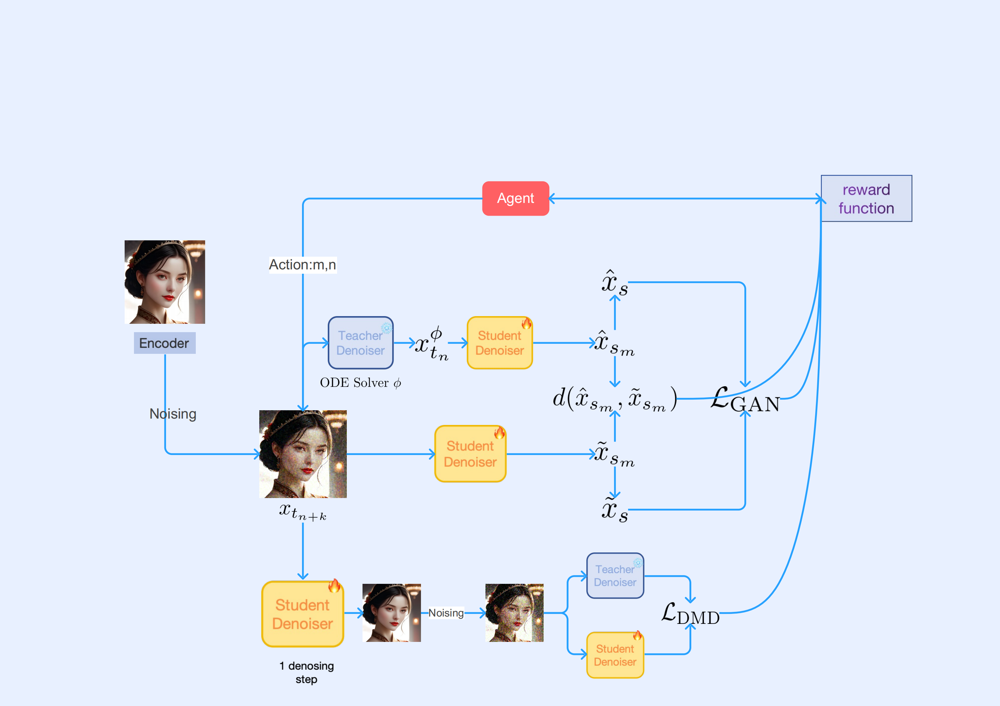

# RLCFM: Reinforcement Learning for Consistency Flow Matching

Official research code for **Curvature-Adaptive Consistency Flow Matching:
Autonomous Trajectory Optimization via Reinforcement Learning**
([arXiv:2606.22394](https://arxiv.org/abs/2606.22394)).

RLCFM studies how to improve few-step generation for large flow/diffusion
models by treating consistency-flow distillation as a trajectory optimization
problem. The repository contains the training and inference code used in our
SDXL and FLUX experiments, including RL-guided trajectory scheduling,
DMD-style distillation losses, adversarial consistency training, and LoRA-based
efficient adaptation.

<p align="center">
  <a href="https://arxiv.org/abs/2606.22394"></a>
  
  
  
</p>

## Highlights

- **RL-guided trajectory optimization.** We use a lightweight reinforcement
  learning policy to identify difficult regions along the probability-flow
  trajectory and allocate training emphasis accordingly.
- **Few-step consistency-flow generation.** The code supports 4, 8, and 16-step
  evaluation settings for SDXL-style and FLUX-style generation pipelines.
- **Training losses used in the paper.** The repository includes DMD-style
  objectives, adversarial consistency losses, scheduler modifications, and
  discriminator modules.
- **Reproducible experiment entry points.** Training and inference scripts are
  organized under separate SDXL and FLUX backends, with paths exposed in shell
  scripts for model and dataset substitution.

## Method Overview

RLCFM starts from a pretrained flow/diffusion teacher and trains a compact
student trajectory for few-step inference. Instead of using a fixed schedule,
the RL scheduler probes the trajectory and assigns more attention to high
difficulty regions. The final training objective combines flow-consistency
distillation with DMD and adversarial refinement.

<p align="center">
  
</p>

## Repository Structure

```text
RLCFM/
  FLUX/
    test_image_flux.py                 # FLUX inference/evaluation entry point
    train_tdd_adv.py                   # FLUX training script
    train_tdd_adv.sh                   # FLUX training launcher
    pcm_scheduling_flowmatch_modified.py
    pcm_discriminator_flux.py
    dataset_myself.py
  SDXL/
    train_pcm_base_model_sdxl_adv_RL.py
    train_pcm_base_model_sdxl_RL_dmd.sh
    DMD_loss.py
    discriminator_sdxl.py
    scheduling_ddpm_modified.py
    get_phased_weight.py
  asset/
    paradigm.png
    combined.png
  requirements.txt
```

## Installation

The experiments were developed with Python 3.10, PyTorch, Hugging Face
Diffusers, Accelerate, and PEFT. A typical setup is:

```bash
git clone https://github.com/solitaryTian/RLCFM.git
cd RLCFM

conda create -n rlcfm python=3.10 -y
conda activate rlcfm

pip install -r RLCFM/requirements.txt
pip install diffusers peft safetensors pytorch-lightning wandb
```

For large-model training, install the acceleration packages that match your CUDA
environment, for example:

```bash
pip install xformers bitsandbytes
```

Some FLUX inference experiments use `skrample` samplers. Install it if you use
the corresponding scheduler wrapper in `RLCFM/FLUX/test_image_flux.py`.

## Before Running Experiments

The released scripts preserve the experiment structure used in our internal
runs. Before launching them, replace the local paths in the shell scripts with
your own model and dataset locations.

For SDXL training, edit:

```bash
RLCFM/SDXL/train_pcm_base_model_sdxl_RL_dmd.sh
```

Key variables:

```bash
MODEL_DIR=/path/to/stable-diffusion-xl-base-1.0
VAE_DIR=/path/to/sdxl-vae-fp16-fix
DATA_DIR=/path/to/cc3m_or_custom_image_info.json
OUTPUT_DIR=outputs/your_sdxl_run
```

For FLUX training, edit:

```bash
RLCFM/FLUX/train_tdd_adv.sh
```

Key variables:

```bash
PRETRAINED_TEACHER_MODEL=/path/to/FLUX.1-dev
TRAIN_SHARDS_PATH_OR_URL=/path/to/train_metadata_or_webdataset
OUTPUT_DIR=outputs/your_flux_run
```

For FLUX inference, edit the checkpoint and model settings in:

```bash
RLCFM/FLUX/test_image_flux.py
```

Key variables:

```python
checkpoint_list = [4200]
model_id = "/path/to/FLUX.1-dev"
sd_type = "your_output_subdirectory"
```

## Quick Start: FLUX Inference

After training a LoRA checkpoint, run:

```bash
cd RLCFM/FLUX
python test_image_flux.py
```

The script loads:

```text
outputs/{sd_type}/checkpoint-{checkpoint}/pytorch_lora_weights.safetensors
```

and saves generated images to:

```text
outputs/{sd_type}/pictures/
```

## Training

### SDXL RLCFM Training

```bash
cd RLCFM/SDXL
bash train_pcm_base_model_sdxl_RL_dmd.sh
```

This launcher enables:

- RL trajectory weighting through `--RL_epsilon`
- DMD loss through `--dmd_loss` and `--dmd_weight`
- adversarial refinement through `--adv_weight`
- LoRA training through `--lora_rank`
- memory-saving options such as fp16, xFormers, 8-bit Adam, and gradient
  checkpointing

### FLUX Training

```bash
cd RLCFM/FLUX
bash train_tdd_adv.sh
```

This launcher trains a FLUX LoRA model with adversarial consistency refinement
and configurable few-step inference ranges.

## Results

### FID on CC3M with SDXL

Lower is better.

| Method | 4-Step | 8-Step | 16-Step |
| --- | ---: | ---: | ---: |
| SDXL-Lightning | 37.49 | 38.28 | 40.22 |
| SDXL-Turbo (512x512) | 52.90 | 65.25 | 77.13 |
| LCM | 45.57 | 43.67 | 43.33 |
| Hyper-SD | 39.43 | 41.63 | 44.12 |
| PCM | 37.26 | 39.30 | 40.47 |
| Instaflow | 38.13 | 35.60 | 34.43 |
| TDD | 41.75 | 46.00 | 51.22 |
| TCD | 46.40 | 49.51 | 54.68 |
| **RLCFM (ours)** | **35.29** | **34.42** | **33.49** |

### Aesthetic Evaluation on SDXL

Higher is better.

| Method | 4-Step HPS | 4-Step Aesthetic | 4-Step PickScore | 8-Step HPS | 8-Step Aesthetic | 8-Step PickScore | 16-Step HPS | 16-Step Aesthetic | 16-Step PickScore |
| --- | ---: | ---: | ---: | ---: | ---: | ---: | ---: | ---: | ---: |
| SDXL-Lightning | 0.2666 | 5.7135 | **21.3174** | 0.2721 | 5.8287 | 21.2698 | 0.2660 | 5.8600 | 21.0609 |
| SDXL-Turbo | 0.2587 | 5.3267 | 20.6089 | 0.2471 | 5.2256 | 20.2537 | 0.2393 | 5.1566 | 20.0273 |
| Hyper-SD | **0.2855** | 5.8806 | 21.2701 | 0.2862 | 5.9284 | **21.4551** | 0.2898 | 5.9372 | 21.4797 |
| LCM | 0.2431 | 5.4165 | 20.8978 | 0.2493 | 5.4680 | 20.9471 | 0.2473 | 5.4863 | 20.8295 |
| PCM | 0.2663 | 5.6441 | 21.0911 | 0.2731 | 5.7256 | 21.1061 | 0.2704 | 5.7573 | 20.9734 |
| PerFlow | 0.2472 | 5.5360 | 21.0710 | 0.2522 | 5.5813 | 21.1527 | 0.2560 | 5.6136 | 21.1934 |
| TDD | 0.2609 | 5.7519 | 20.9910 | 0.2602 | 5.8571 | 20.8012 | 0.2511 | 5.8673 | 20.4932 |
| TCD | 0.2576 | 5.5966 | 20.7705 | 0.2543 | 5.6558 | 20.5408 | 0.2450 | 5.6267 | 20.2597 |
| **RLCFM (ours)** | 0.2764 | **5.8931** | 21.2241 | **0.2875** | **5.9423** | 21.3321 | **0.2932** | **5.9823** | **21.5532** |

### Ablation: RL and DMD Components

| Method | 4-Step HPS | 4-Step AES | 4-Step PickScore | 8-Step HPS | 8-Step AES | 8-Step PickScore | 16-Step HPS | 16-Step AES | 16-Step PickScore |
| --- | ---: | ---: | ---: | ---: | ---: | ---: | ---: | ---: | ---: |
| RLCFM w/o RL | 0.235 | 5.43 | 20.71 | 0.265 | 5.61 | 21.20 | 0.271 | 5.658 | 21.23 |
| RLCFM w/o DMD loss | 0.239 | 5.485 | 20.784 | 0.263 | 5.594 | 21.16 | 0.270 | 5.623 | 21.18 |
| **RLCFM (ours)** | **0.260** | **5.540** | **20.920** | **0.270** | **5.640** | **21.300** | **0.280** | **5.680** | **21.300** |

## Qualitative Results

<p align="center">
  
</p>

## Practical Notes

- Training large SDXL/FLUX models requires high-memory GPUs. Reduce
  `train_batch_size`, `resolution`, or `lora_rank` if you encounter OOM errors.
- The shell scripts use `resume_from_checkpoint=latest` by default. Remove or
  modify this flag for a fresh run.
- The repository currently focuses on research reproducibility and experiment
  code. Pretrained checkpoints are not bundled in this repository.

## Citation

If you find this repository useful, please cite:

```bibtex
@article{tian2026curvature,
  title={Curvature-Adaptive Consistency Flow Matching: Autonomous Trajectory Optimization via Reinforcement Learning},
  author={Tian, Songtao and Chen, Guhan and Li, Bohan and Ma, Jingyi and Yu, Zixiong},
  journal={arXiv preprint arXiv:2606.22394},
  year={2026}
}
```

## Acknowledgements

This codebase builds on the PyTorch, Hugging Face Diffusers, Accelerate, PEFT,
and related open-source ecosystems. We thank the maintainers of these projects
for making large-scale generative-model research easier to reproduce.
