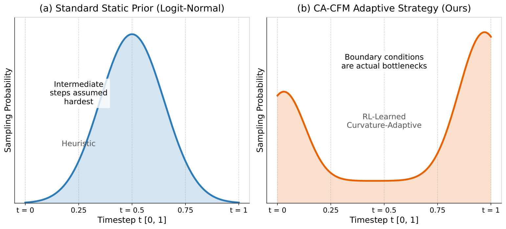
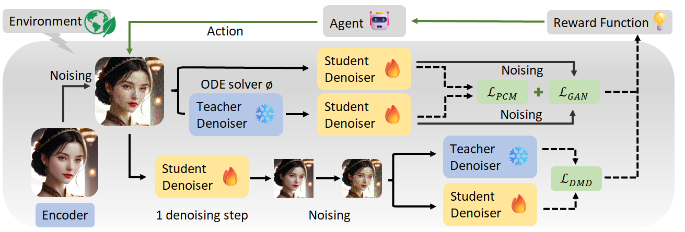
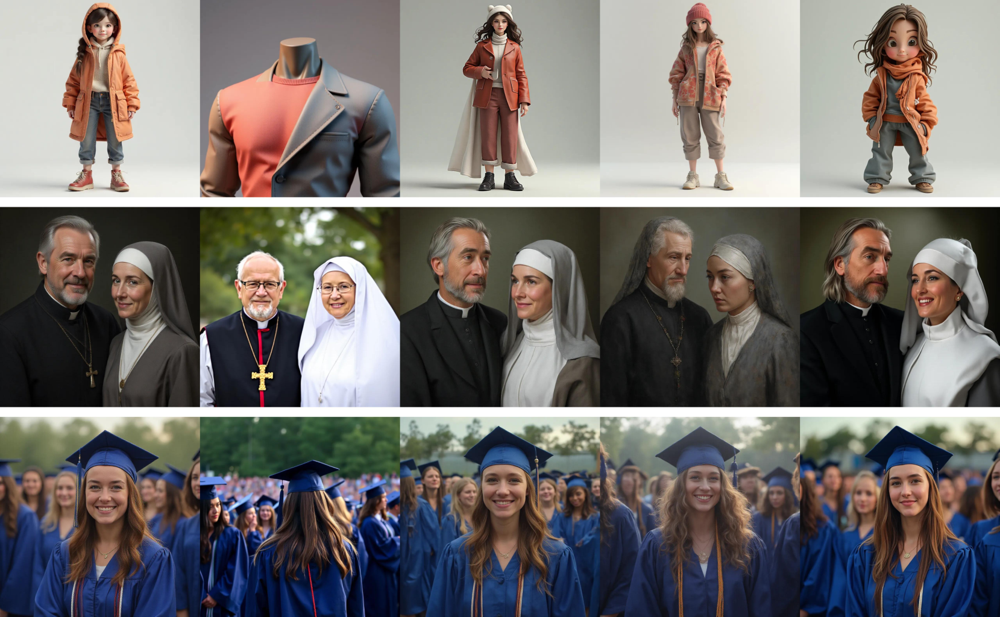
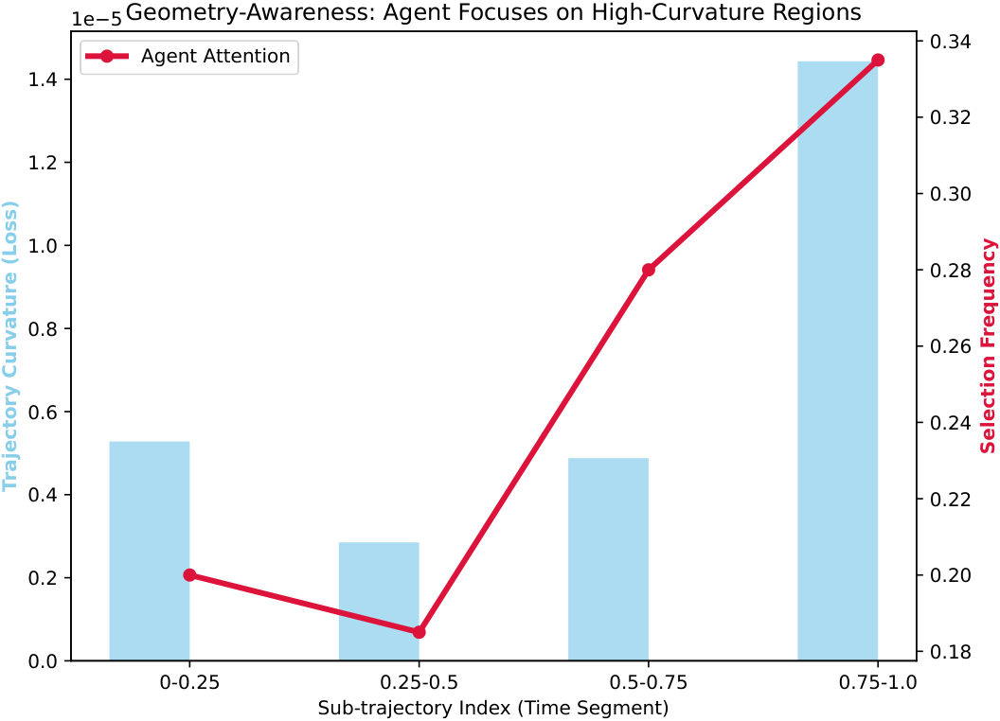
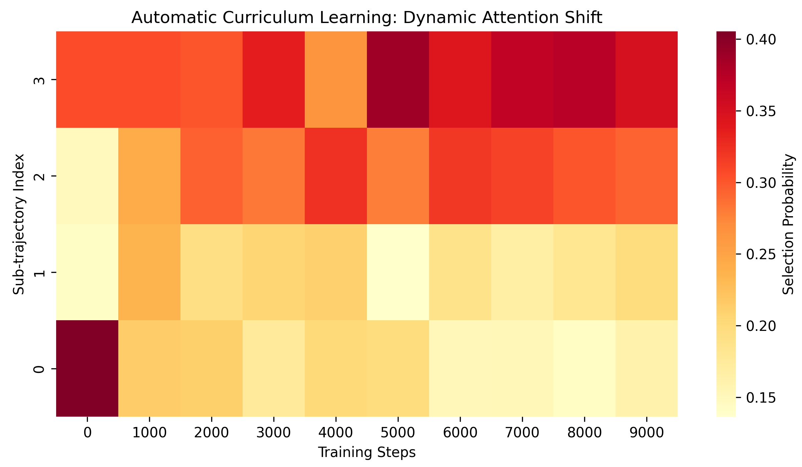

# CACFM: Curvature-Adaptive Consistency Flow Matching

Official research code for **Curvature-Adaptive Consistency Flow Matching:
Autonomous Trajectory Optimization via Reinforcement Learning**
(**ECCV 2026 Accepted**, [arXiv:2606.22394](https://arxiv.org/abs/2606.22394)).

Consistency distillation accelerates diffusion and flow-matching models, but
static timestep priors do not match the difficulty profile of few-step
distillation. CACFM formulates distillation as a dynamic decision process: a
lightweight reinforcement-learning scheduler probes the probability-flow ODE
trajectory, discovers boundary-dominated bottlenecks, and builds an adaptive
curriculum for high-curvature regions. Together with Flow-adapted DMD and
adversarial consistency objectives, CACFM improves few-step generation on
large-scale FLUX and SDXL backbones.

<p align="center">
  <a href="https://arxiv.org/abs/2606.22394"></a>
  
  
  
  
</p>

<p align="center">
  
</p>

<p align="center"><em>1024 x 1024 samples produced by our 4-step generator distilled from FLUX.1-dev.</em></p>

## Highlights

- **Geometric bottleneck discovery.** CACFM reveals that consistency
  distillation can have a boundary-dominated, U-shaped difficulty profile,
  unlike the intermediate-focused Logit-Normal prior used in standard
  iterative generation.
- **RL-based curvature-adaptive scheduler.** A tabular Q-learning agent selects
  high-yield sub-trajectories based on relative consistency losses, replacing
  static sampling schedules with a dynamic curriculum.
- **Hybrid high-fidelity objective.** Training combines consistency
  distillation, Flow-adapted DMD, and adversarial consistency losses.
- **Large-backbone experiments.** This repository contains the SDXL and FLUX
  training/inference code used for the paper's few-step generation results.

## Method Overview

CACFM treats sub-trajectory selection as a compact Markov decision process. We
partition the continuous trajectory into semantic stages, rank their current
consistency losses to form a low-dimensional state, and use Q-learning to choose
the next curvature focus. The selected segment receives the consistency,
adversarial, and DMD updates, while the reward is computed from consistency-loss
improvement over a moving baseline.

<p align="center">
  
</p>

<p align="center">
  
</p>

## Repository Structure

```text
.
├── FLUX/
│   ├── test_image_flux.py
│   ├── train_tdd_adv.py
│   ├── train_tdd_adv.sh
│   ├── pcm_scheduling_flowmatch_modified.py
│   ├── pcm_discriminator_flux.py
│   └── dataset_myself.py
├── SDXL/
│   ├── train_pcm_base_model_sdxl_adv_RL.py
│   ├── train_pcm_base_model_sdxl_RL_dmd.sh
│   ├── DMD_loss.py
│   ├── discriminator_sdxl.py
│   ├── scheduling_ddpm_modified.py
│   └── get_phased_weight.py
├── assets/
│   ├── teaser_flux_4step.png
│   ├── comparison_flux.png
│   ├── comparison_sdxl.png
│   ├── concept_u_shape.png
│   ├── training_paradigm.png
│   ├── policy_alignment.png
│   ├── policy_curriculum.png
│   └── q_table_convergence.png
├── requirements.txt
└── README.md
```

## Installation

The experiments were developed with Python 3.10, PyTorch, Hugging Face
Diffusers, Accelerate, and PEFT.

```bash
git clone https://github.com/solitaryTian/CACFM.git
cd CACFM

conda create -n rlcfm python=3.10 -y
conda activate rlcfm

pip install -r requirements.txt
pip install diffusers peft safetensors pytorch-lightning wandb
```

For large-model training, install the acceleration packages that match your CUDA
environment:

```bash
pip install xformers bitsandbytes
```

Some FLUX inference experiments use `skrample` samplers. Install it if you use
the scheduler wrapper in `FLUX/test_image_flux.py`.

## Before Running Experiments

The released scripts preserve the experiment entry points used in our runs.
Before launching them, replace the model and dataset paths with your own local
paths.

For SDXL training, edit:

```bash
SDXL/train_pcm_base_model_sdxl_RL_dmd.sh
```

Key variables:

```bash
MODEL_DIR=/path/to/stable-diffusion-xl-base-1.0
VAE_DIR=/path/to/sdxl-vae-fp16-fix
DATA_DIR=/path/to/cc3m_or_custom_image_info.json
OUTPUT_DIR=outputs/your_sdxl_run
```

For FLUX training, edit:

```bash
FLUX/train_tdd_adv.sh
```

Key variables:

```bash
PRETRAINED_TEACHER_MODEL=/path/to/FLUX.1-dev
TRAIN_SHARDS_PATH_OR_URL=/path/to/train_metadata_or_webdataset
OUTPUT_DIR=outputs/your_flux_run
```

For FLUX inference, edit:

```bash
FLUX/test_image_flux.py
```

Key variables:

```python
checkpoint_list = [4200]
model_id = "/path/to/FLUX.1-dev"
sd_type = "your_output_subdirectory"
```

## Quick Start: FLUX Inference

After training a LoRA checkpoint, run:

```bash
cd FLUX
python test_image_flux.py
```

The script loads:

```text
outputs/{sd_type}/checkpoint-{checkpoint}/pytorch_lora_weights.safetensors
```

and saves generated images to:

```text
outputs/{sd_type}/pictures/
```

## Training

### SDXL CACFM Training

```bash
cd SDXL
bash train_pcm_base_model_sdxl_RL_dmd.sh
```

This launcher enables:

- tabular Q-learning trajectory routing with epsilon decay
- DMD loss through `--dmd_loss` and `--dmd_weight=0.5`
- adversarial refinement through `--adv_weight`
- LoRA training through `--lora_rank`
- memory-saving options such as fp16, xFormers, 8-bit Adam, and gradient
  checkpointing

### FLUX CACFM Training

```bash
cd FLUX
bash train_tdd_adv.sh
```

This launcher enables the FLUX CACFM training path:

- tabular Q-learning over four trajectory stages
- epsilon decay from `1.0` to `0.1` over the first 20K RL updates
- Flow-style DMD loss through `--dmd_loss` and `--dmd_weight=0.5`
- adversarial consistency refinement through `--adv_weight`
- configurable few-step inference ranges through `--num_inference_steps_min`
  and `--num_inference_steps_max`

## Results

### FID on CC3M with FLUX

Lower is better.

| Method | 4-Step | 8-Step | 16-Step |
| --- | ---: | ---: | ---: |
| Turbo | 58.22 | 46.24 | 43.66 |
| Hyper-SD | 45.35 | 43.86 | 43.40 |
| TDD | 45.81 | 41.65 | 41.12 |
| Schnell | 41.19 | 40.47 | 39.89 |
| **CACFM (ours)** | **39.19** | **36.96** | **37.62** |

### FID on CC3M with SDXL

Lower is better.

| Step | Lightning | Turbo | LCM | Hyper-SD | PCM | InstaFlow | TDD | TCD | **CACFM** |
| ---: | ---: | ---: | ---: | ---: | ---: | ---: | ---: | ---: | ---: |
| 4 | 37.49 | 52.90 | 45.57 | 39.43 | 37.26 | 38.13 | 41.75 | 46.40 | **35.29** |
| 8 | 38.28 | 65.25 | 43.67 | 41.63 | 39.30 | 35.60 | 46.00 | 49.51 | **34.42** |
| 16 | 40.22 | 77.13 | 43.33 | 44.12 | 40.47 | 34.43 | 51.22 | 54.68 | **33.49** |

### Aesthetic Evaluation on FLUX

Higher is better.

| Method | 4-Step HPS | 4-Step Aesthetic | 4-Step PickScore | 8-Step HPS | 8-Step Aesthetic | 8-Step PickScore | 16-Step HPS | 16-Step Aesthetic | 16-Step PickScore |
| --- | ---: | ---: | ---: | ---: | ---: | ---: | ---: | ---: | ---: |
| Turbo | 0.1293 | 5.5666 | 17.1633 | 0.1372 | 5.7197 | 17.0438 | 0.2658 | 5.7665 | 21.3205 |
| Hyper-SD | 0.2626 | 5.6734 | 21.2479 | **0.2747** | 5.7120 | 21.3677 | **0.2757** | 5.7617 | 21.4478 |
| TDD | 0.2454 | 5.6165 | 20.7101 | 0.2610 | 5.6576 | 20.9471 | 0.2609 | 5.6383 | 20.8932 |
| Schnell | **0.2713** | 5.5204 | 21.3134 | 0.2696 | 5.4914 | 21.2159 | 0.2671 | 5.4802 | 21.1154 |
| **CACFM (ours)** | 0.2638 | **5.7955** | **21.3160** | 0.2683 | **5.7961** | **21.3818** | 0.2754 | **5.7967** | **21.4520** |

### Aesthetic Evaluation on SDXL

Higher is better.

| Method | 4-Step HPS | 4-Step Aesthetic | 4-Step PickScore | 8-Step HPS | 8-Step Aesthetic | 8-Step PickScore | 16-Step HPS | 16-Step Aesthetic | 16-Step PickScore |
| --- | ---: | ---: | ---: | ---: | ---: | ---: | ---: | ---: | ---: |
| Lightning | 0.2666 | 5.7135 | **21.3174** | 0.2721 | 5.8287 | 21.2698 | 0.2660 | 5.8600 | 21.0609 |
| Turbo | 0.2587 | 5.3267 | 20.6089 | 0.2471 | 5.2256 | 20.2537 | 0.2393 | 5.1566 | 20.0273 |
| Hyper-SD | **0.2855** | 5.8806 | 21.2701 | 0.2862 | 5.9284 | **21.4551** | 0.2898 | 5.9372 | 21.4797 |
| LCM | 0.2431 | 5.4165 | 20.8978 | 0.2493 | 5.4680 | 20.9471 | 0.2473 | 5.4863 | 20.8295 |
| PCM | 0.2663 | 5.6441 | 21.0911 | 0.2731 | 5.7256 | 21.1061 | 0.2704 | 5.7573 | 20.9734 |
| InstaFlow | 0.2472 | 5.5360 | 21.0710 | 0.2522 | 5.5813 | 21.1527 | 0.2560 | 5.6136 | 21.1934 |
| TDD | 0.2609 | 5.7519 | 20.9910 | 0.2602 | 5.8571 | 20.8012 | 0.2511 | 5.8673 | 20.4932 |
| TCD | 0.2576 | 5.5966 | 20.7705 | 0.2543 | 5.6558 | 20.5408 | 0.2450 | 5.6267 | 20.2597 |
| **CACFM (ours)** | 0.2764 | **5.8931** | 21.2241 | **0.2875** | **5.9423** | 21.3321 | **0.2932** | **5.9823** | **21.5532** |

### Training Efficiency

Lower FID is better.

| Method | Relative Time / Step | 12 Hours | 24 Hours | 36 Hours |
| --- | ---: | ---: | ---: | ---: |
| PCM | 1.00x | 46.52 | 43.10 | 41.65 |
| **CACFM (ours)** | 1.18x | **44.15** | **40.82** | **39.19** |

### Ablation: RL and DMD Components

| Method | 4-Step HPS | 4-Step Aesthetic | 4-Step PickScore | 8-Step HPS | 8-Step Aesthetic | 8-Step PickScore | 16-Step HPS | 16-Step Aesthetic | 16-Step PickScore | Avg Rank |
| --- | ---: | ---: | ---: | ---: | ---: | ---: | ---: | ---: | ---: | ---: |
| Naive CFM (Uniform) | 0.236 | 5.432 | 20.69 | 0.264 | 5.602 | 21.12 | 0.272 | 5.646 | 21.16 | 4.11 |
| CFM Logit-Normal | 0.232 | 5.458 | 20.70 | 0.265 | 5.598 | 20.21 | 0.270 | 5.637 | 21.11 | 4.89 |
| CFM Loss-Aware | 0.236 | 5.436 | 20.77 | 0.263 | 5.588 | 21.16 | 0.270 | 5.659 | 21.17 | 4.00 |
| CACFM w/o DMD | 0.239 | 5.485 | 20.78 | 0.263 | 5.594 | 21.16 | 0.270 | 5.623 | 21.18 | 3.78 |
| CACFM w/o RL | 0.235 | 5.430 | 20.71 | 0.265 | 5.610 | 21.20 | 0.271 | 5.658 | 21.23 | 3.22 |
| **CACFM (ours)** | **0.276** | **5.893** | **21.22** | **0.288** | **5.942** | **21.33** | **0.293** | **5.982** | **21.55** | **1.00** |

## Qualitative Comparisons

### FLUX

<p align="center">
  
</p>

### SDXL

<p align="center">
  
</p>

## Policy Analysis

The learned scheduler aligns with the U-shaped consistency-error profile and
develops a coarse-to-fine curriculum during training.

<p align="center">
  
  
</p>

## Practical Notes

- Training large SDXL/FLUX models requires high-memory GPUs. Reduce
  `train_batch_size`, `resolution`, or `lora_rank` if you encounter OOM errors.
- The shell scripts use `resume_from_checkpoint=latest` by default. Remove or
  modify this flag for a fresh run.
- The repository focuses on research reproducibility and experiment code.
  Pretrained checkpoints are not bundled.
- The original experiment scripts intentionally expose model and dataset paths
  as shell variables so that users can adapt the code to their local storage
  layout.

## Citation

If you find this repository useful, please cite:

```bibtex
@article{tian2026curvature,
  title={Curvature-Adaptive Consistency Flow Matching: Autonomous Trajectory Optimization via Reinforcement Learning},
  author={Tian, Songtao and Chen, Guhan and Li, Bohan and Ma, Jingyi and Yu, Zixiong},
  journal={European Conference on Computer Vision (ECCV)},
  year={2026}
}
```

## Acknowledgements

This codebase builds on PyTorch, Hugging Face Diffusers, Accelerate, PEFT, and
related open-source ecosystems. We thank the maintainers of these projects for
making large-scale generative-model research easier to reproduce.
