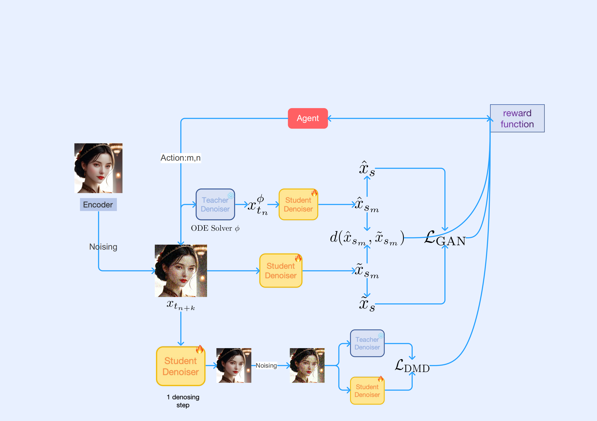

# RLCFM: A Reinforcement Learning Framework for High-Efficiency Consistency Flow Matching





### 🌟Table 1: Quantitative Results on CC3M Dataset

**Bold** = best, <ins>Underline</ins> = second best. All results on 4-step generation.

#### Comparison of FID on CC3M with SDXL.

| Methods          | 4-Step | 8-Step | 16-Step |
|------------------|--------|--------|---------|
| SDXL-Lightning   | 37.49  | 38.28  | 40.22   |
| SDXL-Turbo (512×512) | 52.90 | 65.25 | 77.13   |
| LCM              | 45.57  | 43.67  | 43.33   |
| Hyper-SD         | 39.43  | 41.63  | 44.12   |
| PCM              | 37.26  | 39.30  | 40.47   |
| Instaflow        | 38.13  | 35.60  | 34.43   |
| TDD              | 41.75  | 46.00  | 51.22   |
| TCD              | 46.40  | 49.51  | 54.68   |
| **Ours**         | **35.29** | **34.42** | **33.49** |

#### Aesthetic evaluation on SDXL

| Methods    | 4-Step HPS | 4-Step Aesthetic | 4-Step Pickscore | 8-Step HPS | 8-Step Aesthetic | 8-Step Pickscore | 16-Step HPS | 16-Step Aesthetic | 16-Step Pickscore |
|------------|-----------|------------------|------------------|-----------|------------------|------------------|------------|-------------------|-------------------|
| lightning  | 0.2666    | 5.7135           | **21.3174**      | 0.2721    | 5.8287           | 21.2698          | 0.2660     | 5.8600            | 21.0609           |
| turbo      | 0.2587    | 5.3267           | 20.6089          | 0.2471    | 5.2256           | 20.2537          | 0.2393     | 5.1566            | 20.0273           |
| hyper-sd   | **0.2855**| 5.8806           | 21.2701          | 0.2862    | 5.9284           | **21.4551**      | 0.2898     | 5.9372            | 21.4797           |
| lcm        | 0.2431    | 5.4165           | 20.8978          | 0.2493    | 5.4680           | 20.9471          | 0.2473     | 5.4863            | 20.8295           |
| pcm        | 0.2663    | 5.6441           | 21.0911          | 0.2731    | 5.7256           | 21.1061          | 0.2704     | 5.7573            | 20.9734           |
| perflow    | 0.2472    | 5.5360           | 21.0710          | 0.2522    | 5.5813           | 21.1527          | 0.2560     | 5.6136            | 21.1934           |
| tdd        | 0.2609    | 5.7519           | 20.9910          | 0.2602    | 5.8571           | 20.8012          | 0.2511     | 5.8673            | 20.4932           |
| tcd        | 0.2576    | 5.5966           | 20.7705          | 0.2543    | 5.6558           | 20.5408          | 0.2450     | 5.6267            | 20.2597           |
| **Ours**   | 0.2764    | **5.8931**       | 21.2241          | **0.2875**| **5.9423**       | 21.3321          | **0.2932** | **5.9823**        | **21.5532**       |
#### Aesthetic ablation study on the adversarial and dmd loss.

| Methods          | 4-Step HPS | 4-Step AES | 4-Step PICKSCORE | 8-Step HPS | 8-Step AES | 8-Step PICKSCORE | 16-Step HPS | 16-Step AES | 16-Step PICKSCORE |
|------------------|------------|------------|-------------------|------------|------------|-------------------|-------------|-------------|--------------------|
| RLPCM w/o RL     | 0.235      | 5.43       | 20.71             | 0.265      | 5.61       | 21.20             | 0.271       | 5.658       | 21.23              |
| RLPCM w/o DMD loss | 0.239     | 5.485      | 20.784            | 0.263      | 5.594      | 21.16             | 0.270       | 5.623       | 21.18              |
| **RLPCM (ours)** | **0.26**   | **5.54**   | **20.92**         | **0.27**   | **5.64**   | **21.30**         | **0.28**    | **5.68**    | **21.30**          |
---


## Usage

### Inference

- Clone this repository.
```shell
git clone https://github.com/RedAIGC/Target-Driven-Distillation.git
cd Target-Driven-Distillation
conda create -n RLPCM python=3.10 
conda activate RLPCM
pip install -r requirements.txt -i https://pypi.tuna.tsinghua.edu.cn/simple 

git clone https://github.com/huggingface/diffusers

cd diffusers

pip install -e .
```

```python
python test_image_flux.py
```


### Train

```shell
bash train_pcm_base_model_sdxl_RL_dmd.sh
```

